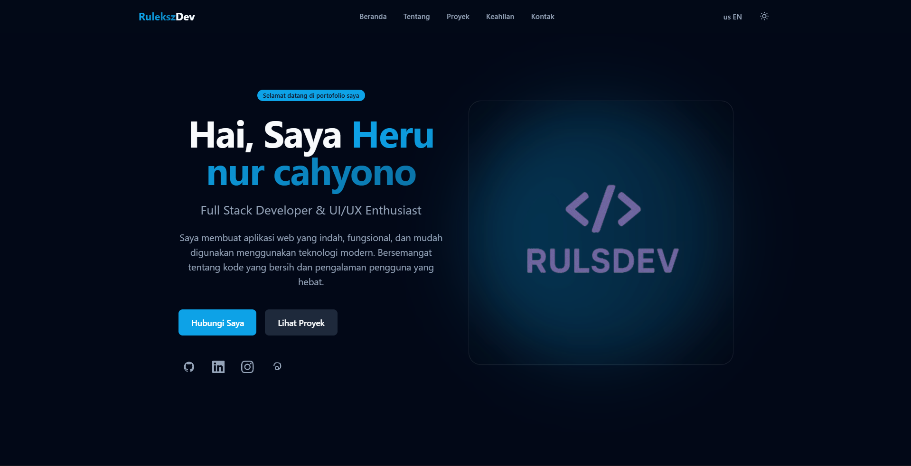
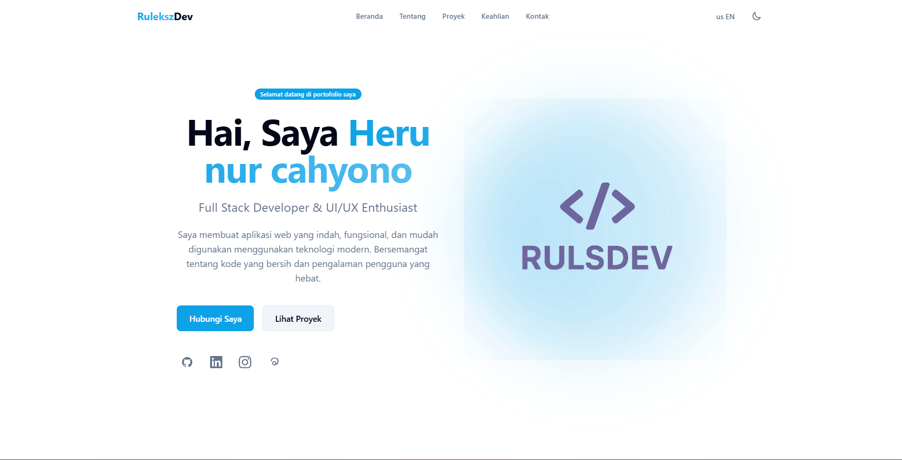

# 🚀 Portfolio - Heru Nur Cahyono

<div align="center">



**Full Stack Developer & UI/UX Enthusiast**

[](https://reactjs.org/)
[](https://vitejs.dev/)
[](https://tailwindcss.com/)
[](LICENSE)

[Live Demo](https://ruleksz.github.io) • [GitHub](https://github.com/ruleksz) • [LinkedIn](https://www.linkedin.com/in/heru-nur-cahyono-5a9737383/)

</div>

---

## 📋 Table of Contents

- [About](#about)
- [Features](#features)
- [Tech Stack](#tech-stack)
- [Getting Started](#getting-started)
- [Project Structure](#project-structure)
- [Configuration](#configuration)
- [Screenshots](#screenshots)
- [Contact](#contact)
- [License](#license)

---

## 📝 About

Portfolio pribadi saya yang dibangun menggunakan **React** dan **Vite** dengan desain modern dan responsif. Website ini menampilkan proyek-proyek yang sudah di-deploy dari GitHub secara real-time, keahlian pemrograman berdasarkan analisis repository, dan formulir kontak yang terintegrasi dengan EmailJS.

Website ini mendukung **dua bahasa** (English/Indonesian) dan memiliki fitur **dark mode** untuk kenyamanan pengguna.

---

## ✨ Features

### 🎨 UI/UX

- **Desain Modern** - Tampilan yang bersih dan profesional dengan animasi yang halus
- **Dark Mode** - Toggle tema gelap/terang dengan persistensi di localStorage
- **Responsive Design** - Tampilan optimal di semua perangkat (mobile, tablet, desktop)
- **Smooth Scrolling** - Navigasi yang mulus antar section
- **Scroll to Top** - Tombol kembali ke atas yang muncul saat discroll

### 🌐 Multi-Language

- **English / Indonesian** - Toggle bahasa dengan persistensi di localStorage
- **Terjemahan Lengkap** - Semua teks UI sudah diterjemahkan

### 📊 Integrasi GitHub API

- **Projects Section** - Menampilkan repository yang sudah di-deploy (Vercel, Netlify, GitHub Pages)
- **Skills Section** - Analisis bahasa pemrograman dari semua repository
- **Statistik Real-time** - Total repositori, bintang, fork, dan bahasa yang digunakan
- **OpenGraph Images** - Preview gambar otomatis dari GitHub

### 📧 Email Integration

- **EmailJS** - Formulir kontak yang mengirim email langsung ke inbox
- **Validasi Formulir** - Validasi input sisi klien
- **Status Feedback** - Notifikasi sukses/gagal pengiriman

### 🔐 Keamanan

- **GitHub Token** - Autentikasi API untuk menghindari rate limiting
- **Environment Variables** - Konfigurasi sensitif di .env

---

## 🛠️ Tech Stack

| Kategori          | Teknologi           |
| ----------------- | ------------------- |
| **Framework**     | React 19.2.6        |
| **Build Tool**    | Vite 8.0.12         |
| **Styling**       | Tailwind CSS 3.4.19 |
| **Email Service** | EmailJS             |
| **API**           | GitHub REST API v3  |
| **Linting**       | ESLint              |
| **PostCSS**       | Autoprefixer        |

---

## 🚀 Getting Started

### Prerequisites

- **Node.js** (v18 atau lebih tinggi)
- **npm** atau **yarn**

### Installation

1. **Clone repository**

   ```bash
   git clone https://github.com/ruleksz/portfolio.git
   cd portfolio
   ```

2. **Install dependencies**

   ```bash
   npm install
   ```

3. **Buat file `.env`** di root project

   ```env
   VITE_GITHUB_USERNAME=ruleksz
   VITE_GITHUB_TOKEN=your_github_token_here
   VITE_EMAILJS_SERVICE_ID=your_service_id
   VITE_EMAILJS_TEMPLATE_ID=your_template_id
   VITE_EMAILJS_PUBLIC_KEY=your_public_key
   ```

4. **Jalankan development server**

   ```bash
   npm run dev
   ```

5. **Buka browser** dan akses `http://localhost:5173`

### Available Scripts

| Command           | Description                 |
| ----------------- | --------------------------- |
| `npm run dev`     | Jalankan development server |
| `npm run build`   | Build untuk production      |
| `npm run preview` | Preview hasil build         |
| `npm run lint`    | Jalankan ESLint             |

---

## 📁 Project Structure

```
portfolio/
├── public/
│   ├── favicon.svg          # Icon browser tab
│   ├── icons.svg            # Icon sprite
│   └── mylogo.png           # Logo profile
├── src/
│   ├── assets/
│   │   └── mylogo.png       # Profile image
│   ├── components/
│   │   ├── Navbar.jsx       # Navigasi dengan theme & language toggle
│   │   ├── Hero.jsx         # Section utama dengan intro
│   │   ├── About.jsx        # Tentang saya
│   │   ├── Projects.jsx     # Proyek dari GitHub (real-time)
│   │   ├── Skills.jsx       # Keahlian dari GitHub (real-time)
│   │   ├── Contact.jsx      # Formulir kontak dengan EmailJS
│   │   ├── Footer.jsx       # Footer dengan social links
│   │   └── ScrollToTop.jsx  # Tombol scroll ke atas
│   ├── context/
│   │   ├── ThemeContext.jsx  # Manajemen dark/light mode
│   │   └── LanguageContext.jsx # Manajemen bahasa (EN/ID)
│   ├── App.jsx              # Root component
│   ├── App.css              # Custom styles
│   ├── index.css            # Global styles & Tailwind
│   └── main.jsx             # Entry point
├── index.html               # HTML template
├── package.json             # Dependencies & scripts
├── postcss.config.js        # PostCSS configuration
├── tailwind.config.js       # Tailwind configuration
├── vite.config.js           # Vite configuration
└── eslint.config.js         # ESLint configuration
```

---

## ⚙️ Configuration

### Tailwind CSS

Konfigurasi Tailwind ada di `tailwind.config.js` dengan custom colors yang menggunakan CSS variables untuk mendukung dark mode:

```javascript
module.exports = {
  darkMode: "class",
  theme: {
    extend: {
      colors: {
        background: "var(--background)",
        foreground: "var(--foreground)",
        primary: "var(--primary)",
        // ... lainnya
      },
    },
  },
};
```

### GitHub API

Untuk menggunakan GitHub API, Anda memerlukan **Personal Access Token**:

1. Buka [GitHub Settings > Developer settings > Personal access tokens](https://github.com/settings/tokens)
2. Generate token baru dengan scope `public_repo`
3. Tambahkan token ke file `.env`

### EmailJS

Untuk mengaktifkan formulir kontak:

1. Daftar di [EmailJS](https://www.emailjs.com/)
2. Buat Email Service dan Email Template
3. Tambahkan credentials ke file `.env`

---

## 📸 Screenshots

### 🌙 Dark Mode


### ☀️ Light Mode



---

## 🌍 Bahasa / Languages

Website ini mendukung dua bahasa:

| Fitur      | English                                | Indonesia                                  |
| ---------- | -------------------------------------- | ------------------------------------------ |
| Navigation | Home, About, Projects, Skills, Contact | Beranda, Tentang, Proyek, Keahlian, Kontak |
| Hero       | Welcome to my portfolio                | Selamat datang di portofolio saya          |
| CTA        | Get in Touch / View Projects           | Hubungi Saya / Lihat Proyek                |
| Contact    | Send Message                           | Kirim Pesan                                |

---

## 🔗 Social Links

- **GitHub:** [ruleksz](https://github.com/ruleksz)
- **LinkedIn:** [Heru Nur Cahyono](https://www.linkedin.com/in/heru-nur-cahyono-5a9737383/)
- **Instagram:** [@ruleks_15](https://www.instagram.com/ruleks_15/)
- **Threads:** [@ruleks_15](https://www.threads.com/@ruleks_15)

---

## 📧 Contact

**Heru Nur Cahyono**

- 📧 Email: [nurrulex@gmail.com](mailto:nurrulex@gmail.com)
- 📱 WhatsApp: [+62 8575 5707 238](https://wa.me/+6285755707238)
- 📍 Location: Lamongan, Indonesia

---

## 📄 License

This project is licensed under the MIT License - see the [LICENSE](LICENSE) file for details.

---

<div align="center">

**⭐ Star this repo if you find it helpful!**

Made with ❤️ by [Heru Nur Cahyono](https://github.com/ruleksz)

</div>
